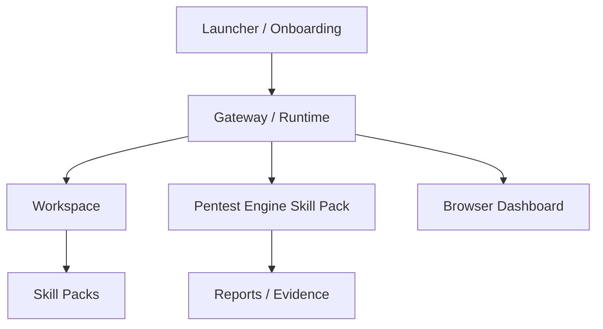

# PentAgent

**Local-first penetration testing platform for authorized environments.**

PentAgent now behaves more like a control plane than a single scanner:
a browser dashboard, a persistent workspace, loadable skill packs, and a
pentest engine that runs as one capability inside the platform.

## Overview

PentAgent is a self-bootstrapping, local-first security platform for
authorized assessments. It keeps model selection, skills, workspace state,
and reports on your machine, while still letting the pentest engine use
Ollama locally or an OpenAI-compatible API backend when you want to offload
compute.

The platform is organized around a persistent workspace and browser
dashboard. The dashboard reads the current checkpoint, skills, runtime
config, and session manifests from the workspace, while the CLI launches the
pentest engine as one skill pack inside that larger shell.

**This tool is intended exclusively for authorized penetration testing and
security validation of systems you own or have explicit written permission
to test.**

At launch you choose the target, mode, scan profile, model, model provider,
autonomy style, and an optional operator mission. The agent auto-pulls the
selected Ollama model if it is missing, prefers Kali/Athena WSL tooling when
available, and keeps going when optional tools fail so it can pivot instead
of stalling.

You can also choose an autonomy style at launch. `free` lets the model drive
the tool path with minimal orchestration; `balanced` keeps a little more
kickoff structure.

If you launch with only model/provider flags and no explicit target, the
agent opens the dashboard plus launcher flow instead of silently starting a
scan. A target must be chosen before a pentest run begins.

## Architecture



### Platform Layers

- `Launcher / Onboarding` configures target, provider, model, autonomy, and mission.
- `Gateway / Runtime` owns the workspace, dashboard, skill catalog, and runtime defaults.
- `Workspace` stores docs, sessions, runtime config, and artifacts locally.
- `Skill Packs` are discovered from `SKILL.md` files and merged with built-in tools.
- `Pentest Engine Skill Pack` is the existing autonomous assessment engine.
- `Browser Dashboard` provides the OpenClaw-style control surface.

## Key Capabilities

| Capability | Description |
|---|---|
| LLM-Driven Orchestration | Your chosen model decides what to scan, what tools to run, and when the assessment is complete |
| Browser Control Plane | Local dashboard shows workspace state, skills, sessions, and runtime defaults |
| Persistent Workspace | Config, sessions, and docs live under `workspace/agents/<agent_id>/` |
| Loadable Skill Packs | Bundled `SKILL.md` packs are discovered from disk and merged with built-in tools |
| Full Terminal Access | The agent can execute shell commands, WSL tools, and custom scripts |
| Self-Bootstrapping | Auto-installs Python dependencies, Playwright, and can install security tools via winget or pip |
| 8 Built-In Security Checks | SSL/TLS, cookies, sensitive paths, CORS, mixed content, email security, info disclosure, security headers |
| Web Crawling & Analysis | Full site mapping, metadata extraction, broken link detection, redirect chain analysis |
| Browser Rendering | Playwright-based screenshots and JS-rendered DOM extraction |
| Lighthouse Integration | Performance, accessibility, SEO, and best-practices scoring |
| Persistent State | Checkpoint/resume support for interrupted assessments |
| Attack-Graph Memory | Tracks discovered surfaces, findings, confidence, and pivots across the run |
| Operator Mission Setting | Set a broad custom mission and let the agent choose the best authorized pivots |
| Model Selection at Startup | Pick the Ollama tag you want, and the agent auto-pulls it if it is missing |
| Provider Selection at Startup | Run a local Ollama backend or an OpenAI-compatible API backend |
| Skill Registry | Built-in tools and file-backed skill packs are cataloged by category |
| WSL Tool Routing | Routes Linux recon and exploitation tools to the best available Kali/Athena WSL distro |
| Autonomy Selection | Choose `free` for maximum model freedom or `balanced` for a bit more kickoff structure |
| Rich Terminal UI | ASCII art banner, live progress, structured tool output, dashboards |
| Structured Reporting | Machine-readable JSON + markdown + HTML reports with detailed findings |
| Release Notes UI | Browser-readable changelog page with release highlights and operator guidance |

## Installation

### Prerequisites

- Python 3.9+
- Ollama for local models
- Node.js, optional, for Lighthouse
- nmap, optional, for native host/service scanning

### Quick Start

```powershell
git clone https://github.com/youruser/pentagent.git
cd pentagent
python -m venv .venv
.\.venv\Scripts\Activate.ps1
python agent.py
```

The script auto-installs all Python dependencies on first run.

### Model Setup

```powershell
ollama serve
ollama pull qwen3-coder:30b
```

Recommended default for strongest reasoning is `qwen3-coder:30b`, but you
can choose any Ollama model tag at startup or with `--model`.

The agent auto-pulls the selected model if it is missing.
This only applies when you choose the local `ollama`/`local` provider;
API-backed runs do not require Ollama on the host.

If you want to offload reasoning later, choose the API-compatible provider
at startup or launch with `--provider api` and point it at an
OpenAI-compatible endpoint.

## Usage

### Interactive Mode

```powershell
python agent.py
```

Interactive launch presents:
- Target or subnet input
- Mode selection (`web` / `network`)
- Model selection
- Provider selection (`ollama` / `api`)
- Autonomy selection (`free` / `balanced`)
- Operator mission
- Resume or fresh session choice

The dashboard starts automatically and stays in sync with the workspace.

### CLI Mode

```powershell
python agent.py http://localhost:3000 --mission "find auth bypass and IDOR"
python agent.py 10.0.0.0/24 --network --autonomy balanced
python agent.py --model qwen3-coder:30b --provider ollama
python agent.py dashboard
python agent.py doctor
python agent.py skills
python agent.py onboard
```

Useful flags:
- `--mission`, `--objective`, or legacy `--task`
- `--autonomy free` or `--autonomy balanced`
- `--dashboard` / `--no-dashboard`
- `--provider ollama` or `--provider api`
- `--api-base` and `--api-key-env` for OpenAI-compatible backends

## Runtime Notes

- `web` mode is for domains and URLs; `network` mode is for CIDRs or `auto`.
- Public DNS recon is used for public domains; localhost and lab-style
  targets skip that noise and go straight to direct enumeration.
- Optional tool failures are logged and the run continues, so the agent can
  pivot instead of dying on a missing binary.
- Lighthouse is optional and depends on a Chromium-capable browser being
  available on the host.
- `free` autonomy mode removes the mission-specific kickoff steps and lets
  the model decide the path from live evidence.

## Workspace Layout

The default workspace lives under `workspace/agents/main/`:

```text
workspace/
└── agents/
    └── main/
        ├── state/
        │   └── checkpoint.json
        ├── sessions/
        ├── artifacts/
        │   ├── audit_report.json
        │   ├── audit_summary.md
        │   ├── audit_summary.html
        │   ├── screenshots/
        │   ├── lighthouse/
        │   └── scan_logs/
        ├── skills/
        └── docs/
            ├── AGENTS.md
            ├── BOOTSTRAP.md
            ├── SOUL.md
            └── TOOLS.md
```

The browser dashboard reads this workspace directly.

## Built-In Security Checks

| Check | What It Tests |
|---|---|
| SSL/TLS Analysis | Certificate validity, expiration, protocol version, cipher strength |
| Security Headers | HSTS, CSP, X-Frame-Options, Referrer-Policy, Permissions-Policy |
| Cookie Security | Secure, HttpOnly, SameSite attributes |
| Sensitive Path Exposure | `.env`, `.git`, `.htpasswd`, `phpinfo.php`, admin panels, backups |
| CORS Misconfiguration | Wildcard, reflected origin, null origin, credentials with wildcard |
| Email Security | SPF and DMARC DNS record validation |
| Information Disclosure | Server version headers, X-Powered-By, error page leakage |
| Mixed Content | HTTP resources loaded on HTTPS pages |

## Security & Authorization

> **Important: This tool is designed exclusively for authorized security testing.**

By using this software, you acknowledge and agree that:

1. You have explicit written authorization to test the target system
2. You will only target systems you own or have permission to assess
3. You understand that unauthorized access to computer systems is illegal in most jurisdictions
4. The authors and contributors are not responsible for misuse of this tool
5. You will comply with all applicable laws

## Contributing

- Keep contributions focused on authorized security testing
- Prefer workspace-backed skill packs for new capabilities
- Keep browser/dashboard changes local-first
- Avoid hardcoding new state under the repository root

## Output Artifacts

Reports are written to the workspace artifacts directory and include:
- JSON report
- Markdown summary
- HTML report
- Screenshots
- Lighthouse JSON
- Scan logs

## License

See [LICENSE](LICENSE).
